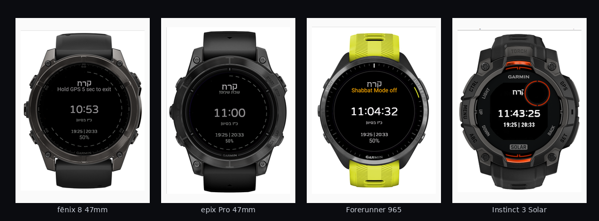
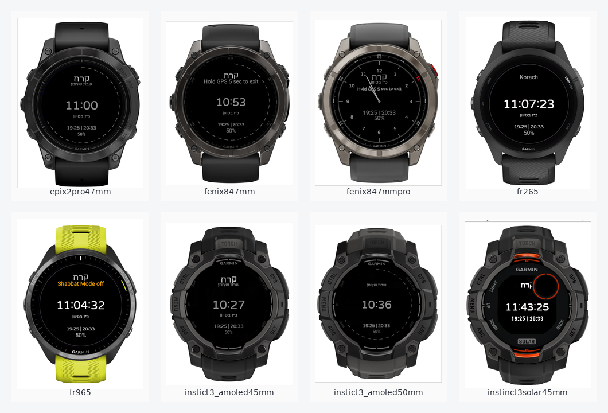

<p align="center">
  
</p>

<h1 align="center">KodeshMode - Free & OpenSource Shabbat Mode</h1>

<p align="center">
  A Hebrew-first open source Garmin Connect IQ watch app for Shabbat-aware display, Hebrew date, parasha, zmanim, and clean watch layouts.
</p>

<p align="center">
  <a href="https://github.com/Ariel-Gal/KodeshMode/stargazers">
    
  </a>
  <a href="https://github.com/Ariel-Gal/KodeshMode/network/members">
    
  </a>
  <a href="https://github.com/Ariel-Gal/KodeshMode/issues">
    
  </a>
  <a href="https://github.com/Ariel-Gal/KodeshMode/blob/main/LICENSE">
    
  </a>
  <a href="https://github.com/Ariel-Gal/KodeshMode/releases">
    
  </a>
  
  
  
</p>

<p align="center">
  <a href="https://github.com/Ariel-Gal/KodeshMode/releases">
    Download the latest release
  </a>
</p>

<p align="center">
  <a href="#features">Features</a> ·
  <a href="#screenshots">Screenshots</a> ·
  <a href="#build-and-run">Build</a> ·
  <a href="#license">License</a>
</p>

<p align="center">
  
</p>

---

## Overview

KodeshMode is a Garmin Connect IQ **watch app** designed around Shabbat use cases and Hebrew display needs. It focuses on readable Hebrew typography, parasha display, Hebrew date, Shabbat times, battery status, and configurable screen elements across AMOLED, MIP, and Solar Garmin watches.

This project is intentionally built as a **watch app**, not a watch face. That keeps the app suitable for controlled entry/exit behavior, Shabbat mode handling, button behavior, touch lock behavior, and dedicated in-app screens.

If this project helps you, please consider giving it a star. ⭐ :)

## Features

| Area | Description |
| --- | --- |
| Hebrew display | Hebrew-first UI with embedded bitmap fonts for reliable rendering on Garmin devices. |
| Shabbat mode | Dedicated Shabbat-aware status and display behavior. |
| Parasha | Weekly parasha display with Hebrew and English resource strings. |
| Hebrew date | Hebrew calendar date and month names. |
| Zmanim | Shabbat start/end display based on location and app settings. |
| Layout controls | Configurable visibility and positioning of display elements. |
| Phone settings | App settings are exposed through Garmin Connect / Connect IQ settings. |
| Watch controls | Button-based watches can use an in-app menu where supported. |
| Touch watches | On touch-first devices, settings should be managed from the phone only. |
| Device coverage | Fenix, Epix, Forerunner, Venu, Vivoactive, Instinct, Enduro, MARQ, and related models. |

## Screenshots

<p align="center">
  
</p>

Additional screenshots are stored in the [`screenshots/`](screenshots/) directory.

| Device | Screenshot |
| --- | --- |
| fēnix 8 47mm | [`screenshots/fenix847mm.png`](screenshots/fenix847mm.png) |
| fēnix 8 47mm Pro | [`screenshots/fenix847mmpro.png`](screenshots/fenix847mmpro.png) |
| epix Pro 47mm | [`screenshots/epix2pro47mm.png`](screenshots/epix2pro47mm.png) |
| Forerunner 265 | [`screenshots/fr265.png`](screenshots/fr265.png) |
| Forerunner 965 | [`screenshots/fr965.png`](screenshots/fr965.png) |
| Instinct 3 AMOLED 45mm | [`screenshots/instict3_amoled45mm.png`](screenshots/instict3_amoled45mm.png) |
| Instinct 3 AMOLED 50mm | [`screenshots/instict3_amoled50mm.png`](screenshots/instict3_amoled50mm.png) |
| Instinct 3 Solar 45mm | [`screenshots/instinct3solar45mm.png`](screenshots/instinct3solar45mm.png) |

## Supported devices

The app is configured for a broad Garmin Connect IQ device set, including:

- fēnix 7 / 7 Pro / 8 / 8 Solar / 8 Pro / fēnix E
- epix 2 / epix Pro
- Enduro 3
- Forerunner 165 / 255 / 265 / 570 / 955 / 965 / 970
- Venu 2 / 3 / 4 / X1 / Sq 2
- vivoactive 5 / 6
- Instinct 3 AMOLED / Solar and related Instinct models
- MARQ 2

The exact product list is defined in [`manifest.xml`](manifest.xml).

## Settings model

KodeshMode uses Garmin Connect IQ app properties and settings for user configuration.

Recommended behavior:

- **Touch watches** such as Venu and Vivoactive: configure settings from the phone only.
- **Button watches** such as fēnix and some Instinct models: in-app menus may be used where supported.
- Mobile-controlled settings should remain the source of truth for production builds.

Common configurable items include:

- Language and parasha schedule
- Clock style, font, size, and time format
- Shabbat progress
- Parasha visibility and font size
- Hebrew date visibility and font size
- Shabbat times visibility and font size
- Omer, battery, and status display
- Per-element layout offsets for phone-side positioning

## Build and run

### Requirements

- Garmin Connect IQ SDK
- Java runtime required by the Connect IQ tooling
- Garmin developer key
- Visual Studio Code with the Monkey C extension, or Garmin CLI tools

### Build with the Garmin tools

```bash
monkeyc -f monkey.jungle -d fenix7 -o bin/KodeshMode.prg -y path/to/developer_key.der
```

### Run in the simulator

```bash
monkeydo bin/KodeshMode.prg fenix7
```

You can also build and run directly from the Garmin Monkey C VS Code extension.

## Project structure

```text
.
├── manifest.xml                     # Connect IQ app metadata and supported devices
├── monkey.jungle                    # Connect IQ project file
├── source/                          # Monkey C source code
│   ├── KodeshModeApp.mc
│   ├── KodeshModeView.mc
│   ├── KodeshSettings.mc
│   ├── ShabbatMode.mc
│   ├── ParashaLookup.mc
│   └── ZmanimEngine.mc
├── resources/
│   ├── settings/                    # Phone/app settings XML
│   ├── strings/                     # Hebrew and English strings
│   ├── fonts/                       # Generated bitmap fonts
│   └── drawables/                   # App launcher assets
├── screenshots/                     # Device screenshots
├── docs/                            # Project documentation assets
├── website/                         # Static landing page and website assets
└── tools/                           # Font generation utilities
```

## Notes about seconds

KodeshMode is a **watch app**, so `HH:MM:SS` can be displayed while the app is active, but Garmin may reduce or pause frequent updates when the app is in a low-power state. The WatchFace-only `onPartialUpdate()` mechanism is not used here because converting the project into a watch face would change the product behavior and reduce app-style interaction capabilities.

## Contributing

Contributions are welcome. Please read [`CONTRIBUTING.md`](CONTRIBUTING.md) before opening a pull request.

Good first contributions:

- Device screenshots
- Font rendering improvements
- Hebrew string fixes
- Zmanim edge-case testing
- Device-specific layout tuning
- Documentation improvements

## Security

Please do not open public issues for security-sensitive reports. See [`SECURITY.md`](SECURITY.md).

## License

The app source code is released under the MIT License. See [`LICENSE`](LICENSE).

Third-party fonts and generated font assets are covered by their original licenses. See [`THIRD_PARTY_LICENSES.md`](THIRD_PARTY_LICENSES.md) and the [`LICENSES/`](LICENSES/) directory.
